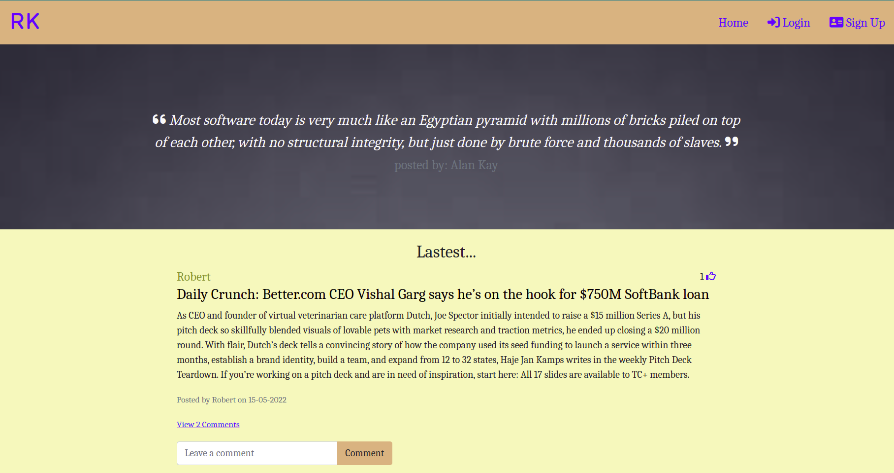
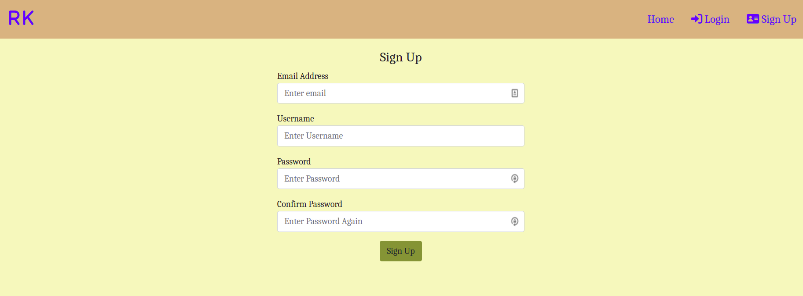
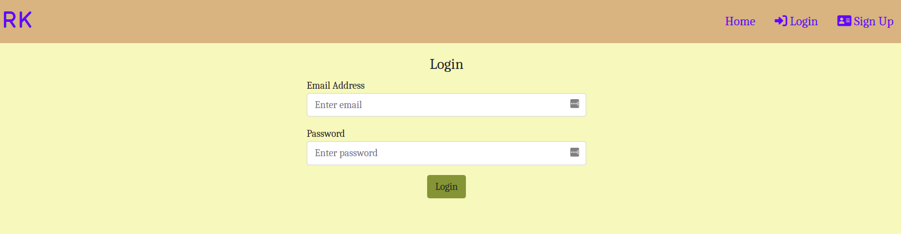

# My Personal Blog

This web application is my personal blog. I post my thoughts on various topics for purposes of documenting my knowledge and also allowing other people to learn from me. 

# By **Robert Kirui**

May 15, 2022.

# Description

I learn alot of things on a daily basis both in tech and in other fields as well. It is important to share this knowledge with others or at least document them for my future reference or when there is need. One way of doing so is blogging. I have created this personal blog website that allows me to create an account and continuosly post my thoughts on interesting topics that I would wish to share with others. Other people can also post on this personal blog but they are required to create an account first. For visitors who do not want to create an account, they can read posts by others and can like those posts or comment on them. Authenticated users can comment on any post and can delete insulting or degrading comments by others on the posts that they posted. Also authenticated users can delete their own posts. 

# User Stories

- As a user, I would like to view the blog posts on the site.
- As a user, I would like to comment on blog posts.
- As a user, I would like to view the most recent posts.
- As a user, I would like to an email alert when a new post is made by joining a subscription.
- As a user, I would like to see random quotes on the site.
- As a writer, I would like to sign in to the blog.
- As a writer, I would also like to create a blog from the application.
- As a writer, I would like to delete comments that I find insulting or degrading.
- As a writer, I would like to update or delete blogs I have created.

# Screenshot 
### home page

### Sign-up page

### Login page

# Behaviour Driven Development (BDD)
- Scenario 1: User reading, commenting, and liking blog posts on the website
  - Reading blogs
  * GIVEN the user is on the home page 
  * AND the user wants to read blog posts
  * THEN the user can  scroll through the page to access and read different blogs posted on the website.

  - Commenting on a blog
  * GIVEN the user is on the home page 
  * AND the user wants to comment on a blog post.
  * WHEN the user enters a comment on the comment input bar
  * THEN the user can click the comment button and the comment is posted.

  - Liking a blog
  * GIVEN the user is on the home page 
  * AND the user wants to like a blog post.
  * THEN the user can click the “thumbs-up” icon on the right side of the blog post and the “like” is added.

- Scenario 2: Writer creating an account
  * GIVEN the writer is on the sign-up page.
  * WHEN the writer enters the required details in the provided fields.
  * THEN the writer can click the “sign up” button and the account is created.

- Scenario 3: Writer  signing in
  * GIVEN the writer is on the login page.
  * WHEN the writer enters the required login details.
  * THEN the writer can click the “login” button and he/she is logged in.

- Scenario 4: Writer  creating a blog post
  * GIVEN the writer is logged in to his/her account on the website.
  * AND has clicked the “Create New Post” button at the bottom of the page.
  * WHEN the writer enters the required blog details in the provided fields and clicks the “Post” button.
  * THEN the blog post is successfully created.

- Scenario 5: Writer  deleting a blog post
  * GIVEN the writer is logged in to his/her account on the website.
  * WHEN the writer scrolls through the page and finds the post to be deleted
  * THEN the writer can click the delete button on the right side of the post and the post is successfully is deleted.

- Scenario 6:  User/writer  deleting a comment
  * GIVEN the user/writer is on the website
  * WHEN the user/writer finds the post with the comment to be deleted.
  * THEN the user/writer can click the “view (number) comments” link below the post to toggle the comments.
  * WHEN the user/writer clicks the delete button at the right side of the comment, the comment is successfully deleted.

# Setup/Installation

- Fork the project from this repo
- Run git clone https://github.com/Kirugik/blog.git to have the project files in your preferred directory on the local machine.
- Change directory into the specific folder containing the project files.
- Run 'pip install -r requirements.txt' to install the project dependencies.
- Run on the terminal using: 'python3.8 manage.py server'

# Technologies Used

Python, Flask, heroku.

# License

- Licensed under the [MIT License] (LICENSE).

Copyright (c) 2022. **Robert Kirui**